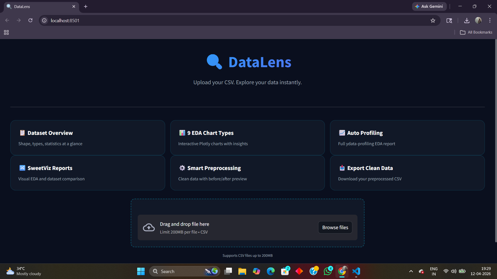
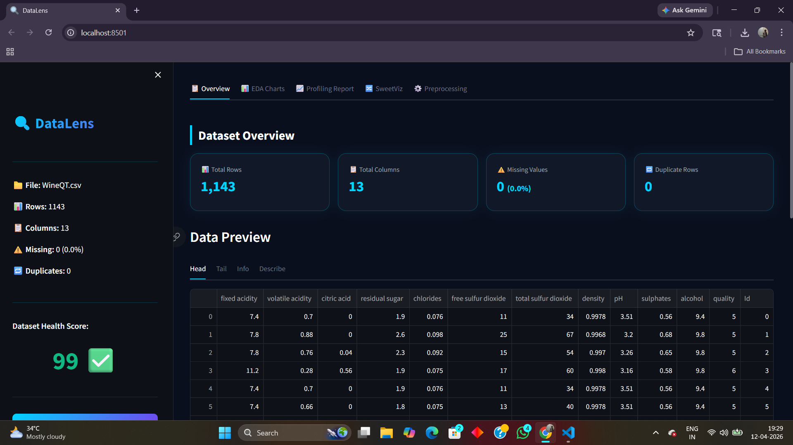
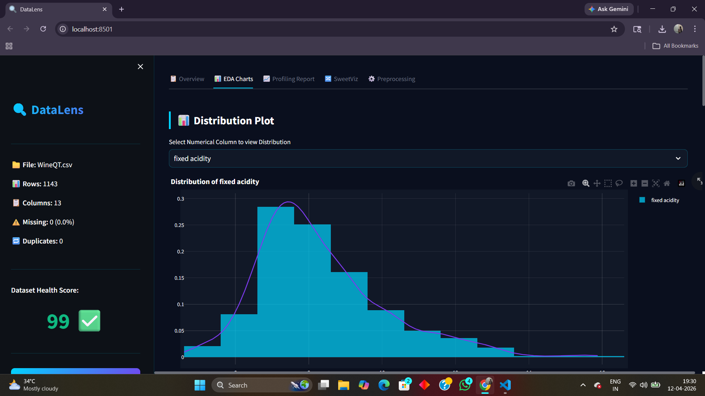
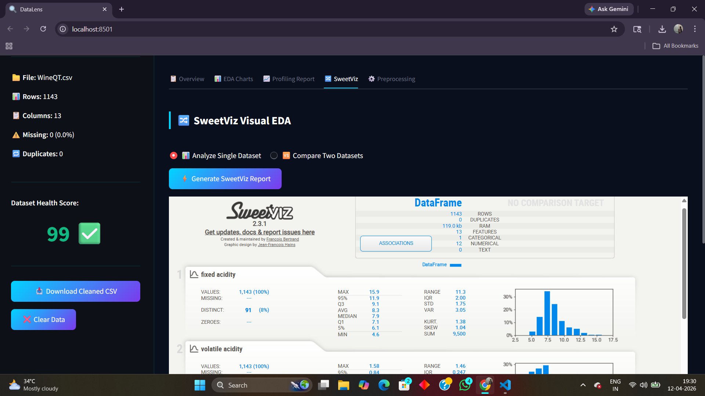
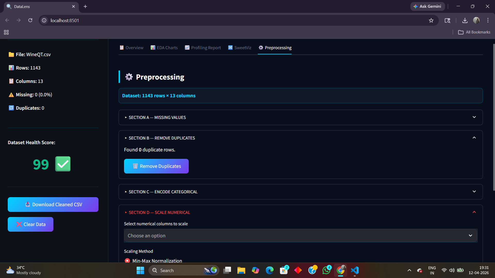

<h1 align="center">🔍 DataLens AI</h1>

<p align="center">
  <strong>Intelligent Exploratory Data Analysis & Preprocessing Studio</strong>
</p>

<p align="center">
  
  
  
  
  
  
</p>

<p align="center">
  <a href="http://localhost:8501">
    
  </a>
</p>

---

## 🚀 Overview

**DataLens AI** is a powerful, no-code Exploratory Data Analysis (EDA) and data preprocessing tool built for data professionals. Skip the repetitive boilerplate scripts—upload any CSV and instantly uncover actionable insights through interactive charts, automated profiling, and smart data cleaning. 

Review dataset health, apply dynamic preprocessing pipelines, and download ready-to-use clean data or full PDF reports with a single click, all from a premium, dark-themed dashboard.

## 💡 Why This Project?

Data preparation and initial exploration typically consume 80% of a data professional's time. Writing ad-hoc scripts for visual distributions, handling missing values, or encoding variables is repetitive and diverts focus from actual problem-solving. 

DataLens AI automates this entire workflow. It reduces the time required for comprehensive dataset understanding from hours to seconds, empowering you to immediately focus on building robust machine learning models and deriving business value instead of writing redundant EDA code.

## ✨ Core Features

- **📊 9 Interactive Chart Types:** Instant visual understanding using high-performance Plotly charts.
- **🧠 Smart Insights:** Auto-generated text interpretations alongside visual charts for rapid understanding.
- **📋 Automated Profiling:** Full dataset report generation utilizing comprehensive SweetViz integrations.
- **🔍 Outlier Detective:** Detect and handle anomalies automatically via robust IQR and Z-Score mechanisms.
- **⚙️ Live Smart Preprocessing:** Segment missing values, drop duplicates, encode categorical data, and scale numericals with real-time before/after feedback.
- **🆚 Dataset Comparison:** Compare and evaluate two distinct CSV datasets simultaneously.
- **📄 One-Click Export:** Download clean CSV datasets and neatly formatted comprehensive PDF reports.
- **🎯 Dynamic Type Inference:** Intelligently detects and routes column data types to their appropriate modeling procedures.

## 🖥️ Visual Walkthrough

### 🏠 Dashboard & Navigation
A modern, dark-themed interface built for a seamless user experience. Focuses on speed and clear data direction.


### 📊 Dataset Overview
Instant macro-perspective highlighting your data footprint—overall shape, health score, and interactive sample preview.


### 📈 EDA Charts
Rich, dynamic visualizations allowing deep-dive interaction into distributions and feature variance.


### 📑 SweetViz Visual Reports
Comprehensive automated data reports rendered beautifully in an integrated frame view.


### ⚙️ Interactive Preprocessing Pipeline
Step-by-step modular UI elements to sanitize your data. Impute, drop, format, and scale effortlessly.


## 🛠️ Technology Stack

| Component | Technology | Purpose |
| :--- | :--- | :--- |
| **Frontend Framework** | `Streamlit` | Interactive and reactive application interface |
| **Data Engine** | `Pandas`, `NumPy` | High-performance in-memory dataset transformations |
| **Visualizations** | `Plotly`, `SweetViz` | Detailed, responsive modeling charts and reports |
| **Machine Learning** | `Scikit-learn` | Enterprise-grade scalers and encoders |
| **Export Engine** | `FPDF2` | Structuring and serving downloadable PDF reports |

## ⚙️ Installation & Usage

**1. Clone the repository**
```bash
git clone https://github.com/yourusername/DataLens-AI.git
cd DataLens-AI
```

**2. Create and activate a virtual environment**
```bash
# Windows
python -m venv venv
venv\Scripts\activate

# Linux / macOS
python3 -m venv venv
source venv/bin/activate
```

**3. Install dependencies**
```bash
pip install -r requirements.txt
```

**4. Launch the application**
```bash
streamlit run app.py
```

## 📁 Architecture Overview

```text
EDA-Project/
├── app.py                 # Core routing and Streamlit dashboard layout
├── eda_charts.py          # Decoupled visualization and plotting logic
├── preprocessing.py       # Data cleaning and transformation pipelines
├── requirements.txt       # Frozen dependencies for deterministic builds
├── sample_data/
│   └── sample.csv         # Starter dataset for immediate testing
└── README.md              # Project documentation
```

## 🚀 Future Improvements

- [ ] **Database Integrations:** Direct connection strings for PostgreSQL, MySQL, and Snowflake.
- [ ] **LLM Data Chat:** Natural language capabilities to query datasets through a conversational interface.
- [ ] **Large Dataset Processing:** Refactoring constraints to utilize Dask or Polars for gigabyte-scale capabilities.
- [ ] **Advanced Format Exporting:** Output clean data natively back into Parquet and JSON formats.

## 👨‍💻 Author

**Your Name**  
[LinkedIn](https://linkedin.com/in/yourprofile) • [GitHub](https://github.com/yourusername) • [Portfolio](https://yourportfolio.com)

## 📄 License

This project is open-source and available under the [MIT License](LICENSE).
